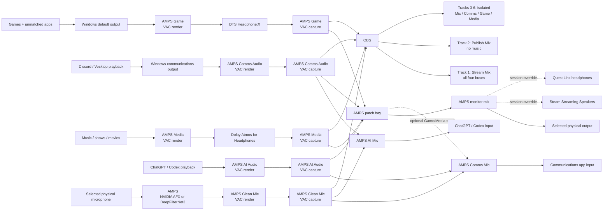

# AMPS

**Audio Mixing and Processing Subsystem** is the full app name; AMPS is used for
device names, binaries, and shortcuts. The existing Intrepid interface and all
five locally bundled interaction sounds are preserved.

## AudioArray rename compatibility

The dotfiles reconciler builds and validates AMPS before stopping AudioArray.
It snapshots startup registrations, all VAC endpoint names, binaries, and saved
state, then imports legacy preferences into `%APPDATA%\AMPS` only when no AMPS
configuration already exists. Existing AMPS preferences win; incomplete or
conflicting state is not silently overwritten. A failed cutover restores the
previous startup entries, endpoint names, binaries, and configuration together.
Backups and the legacy installation remain available for recovery.

Customized base configuration is preserved as well as `controls.toml` and device
history. An unchanged managed base follows future dotfiles updates; a locally
edited base wins and the installer reports that it retained the customization.
If invoked from a packaged Windows host, reconciliation runs once in the normal
user context to avoid private AppData redirection, without requesting elevation.
Logs for that one-shot invocation remain in `~/.cache/dotfiles-amps` on Windows.

Endpoint IDs and routing/control schema keys do not change. The Tauri identity
`ai.hivetech.audioarray`, legacy local-storage keys, and cross-version instance
mutex intentionally stay stable to retain chart positions and sound preferences
and prevent two tray supervisors from running together. `~/code/AMPS` is the
current source shortcut; `~/code/AudioArray` remains a compatibility alias.
No Windows reboot, new audio driver, or Linux backend is part of this rename.

## Audio routing

### Private phone playback (Windows)

Select **Phone Audio** in the graph (or clear the selection), choose a paired
phone, and click **Connect phone**. **Reconnect when AMPS starts** remembers
the choice. Pair/unpair discovery is event-driven; no Store receiver app or
additional audio driver is required. The receiver belongs to the AMPS tray:
closing the window keeps it running, Restart AMPS reconnects it, and Exit AMPS
closes it.

Phone playback follows the engine's **applied Main Output**, including physical
device history and Quest session overrides. Changing the output in AMPS or the
Windows default-device picker changes the phone destination too (normally within
two seconds). If the applied destination cannot be uniquely resolved or is
unavailable, reception closes rather than falling back to the Windows default
VAC cable. It does not enter Media, Game, voice sends, or OBS's isolated buses.
Capturing the physical output directly in another app would still capture what
you hear there. The existing Main Output meter represents the AMPS listening mix;
the separate phone meter/wire measures phone PCM after buffering.

**Phone buffer** is adjustable from 50–500 ms (initially 200 ms). It is a phone-only
timing cushion, in addition to Bluetooth and output-device latency. Changes save
immediately and refill only the phone queue without reconnecting Bluetooth or
restarting the main array. A bounded queue, gentle clock-drift correction, and
short fades reduce timing-related pops; buffering cannot reconstruct samples
already lost in the radio/codec. Short notification tails still play even when
they are too short to fill the configured buffer.

Windows decodes the Bluetooth A2DP stream. AMPS opens its hidden capture endpoint
and owns a buffered WASAPI path to the explicit physical output. The temporary
Windows Listen route is pinned to that output before opening Bluetooth, then
disabled as soon as our capture stream takes over to avoid doubled playback.
It stays disabled on exit. The audio pump is separate from slow discovery and
control work, uses Windows's Audio scheduling class, and performs no disk I/O.
It never restores a default-output route. The hidden capture endpoint is resolved
by exact Bluetooth device-instance identity, not friendly-name matching, and is
not made visible in Windows Sound settings. Meter samples remain in memory;
AMPS does not record phone audio. Audio notifications, silent mode, calls, and
playback after a disconnect remain subject to the phone's own routing rules;
this is not a telephony or notification-mirroring service.

`%APPDATA%\AMPS\phone.toml` stores the machine-local phone selection, buffer size,
and startup preference. `phone-status.json` reports connection/privacy status.
`phone-buffer-status.json` reports aggregate queue depth and underrun/overrun
counters while running; its timestamp distinguishes current from stale results.
The first change retains a `phone-listen-backup-*.json` record of the original
Windows Listen properties. These files contain device identifiers and must not
be committed. Existing unknown settings schemas are rejected without overwrite.
The Windows Bluetooth adapter driver remains a host/OEM prerequisite: receiver
quality can depend on it, particularly with simultaneous phone reception and
Bluetooth headphone playback. Linux uses the same status contract but does not
yet implement phone reception.

### Bus routing

AMPS is Alex's private cross-platform streaming-audio graph. Its Windows
engine is paired with a Tauri operations console; a future Linux engine will
implement the same Rust status/control contract beneath the identical UI. The
seven buses stay intentionally boring and can be plugged together like a small
hardware patch panel:

- **Game**: the Windows default for games and otherwise-unassigned applications.
- **Comms Audio**: received communications from Discord, in-game chat, or other voice apps.
- **Media**: music, shows, movies, and other media playback.
- **AI Audio**: only ChatGPT/Codex playback.
- **AI Mic**: filtered microphone + Discord incoming, sent to ChatGPT/Codex.
- **Comms Mic**: filtered microphone + AI Audio, sent to any communications app.
- **Clean Mic**: the selected Windows input after GPU-preferred noise suppression.

Windows exposes both ends of the signed VAC cables with semantic names instead
of the driver's generic `Line N` labels:

- **AMPS Game**: normal/default playback and OBS's isolated game capture.
- **AMPS Comms Audio** (VAC 2): received communications and OBS's isolated chat capture.
- **AMPS Media**: media playback and OBS's isolated media capture.
- **AMPS AI Audio** (VAC 5): AI playback only.
- **AMPS AI Mic** (VAC 6): the AI's recording input.
- **AMPS Comms Mic** (VAC 7): outgoing communications mix for Discord, in-game chat, or other apps.
- **AMPS Clean Mic** (VAC 4): the pure suppressed microphone, including OBS capture.

Media retains the internal `music` routing/meter key and the same VAC 3 endpoint
IDs. The display-name migration accepts the previous AMPS Music name and
renames the existing endpoints in place, preserving saved routes, app selections,
and OBS bindings. Existing custom OBS source labels may still say Music; newly
provisioned OBS sources and track labels use Media.

Conversation devices use the same perspective: **Audio** is what the app plays;
**Mic** is what it hears. Set Discord's speakers to **AMPS Comms Audio**
and its microphone to **AMPS Comms Mic**. Set the AI app's speakers to
**AMPS AI Audio** and its microphone to **AMPS AI Mic**. Clean Mic
stays the isolated filtered microphone before either configurable mix.
The previous Comms In / Comms Send and ChatGPT Out / ChatGPT In endpoint names
are renamed in place. Internal `comms`, `comms_send`, `chatgpt`, and `chatgpt_in`
keys, Windows endpoint IDs, routing, and app bindings stay unchanged. Custom OBS
source labels are not rewritten; newly provisioned sources use Comms Audio.

AMPS makes Game the normal Windows output, Comms Audio the Windows
communications output, and Clean Mic the normal and communications input.
Games without their own device picker therefore land on Game automatically.
Choosing a physical device in the Windows input or output picker updates
AMPS's recency-ordered hardware history; AMPS then restores the
virtual defaults so applications cannot bypass the graph. If the preferred
device disappears or cannot provide a usable shared-mode format, AMPS
walks that history until it finds one that works.

VAC volume processing remains disabled so its buses stay bit-perfect. The
normal Windows volume/mute control on AMPS Game is instead an event-driven
master control: AMPS mirrors it to the selected physical output and
mirrors Windows-visible physical-device changes back. That volume sits only on
the final monitor sink, downstream of the seven buses, so OBS's isolated tracks
and stream mix are never attenuated. A newly selected physical output supplies
the initial safe volume. Analog controls that do not report state to Windows
cannot be mirrored back.

Bluetooth headsets use separate high-quality A2DP and hands-free HFP transports
behind Windows 11's unified playback endpoint. AMPS keeps monitoring the
same selected headphones while Windows automatically changes transport when
their microphone opens, and Windows returns to A2DP when that microphone
closes. During a graph rebuild, the volume bridge temporarily ignores physical
playback notifications and then restores the chosen master state. This covers
Bluetooth drivers that complete the A2DP-to-HFP transition with the playback
side silently muted, without confusing an intentional user mute for a fault.

## Driver boundary

AMPS does not install an unsigned kernel driver. It uses seven full-duplex
cables from Eugene Muzychenko's signed
[Virtual Audio Cable](https://vac.muzychenko.net/en/) driver. The licensed
installer is private and must never be committed here.

After VAC is installed, the Windows reconciler ensures at least seven active
cable pairs before replacing the running engine. It requests UAC only when
capacity is missing, preserves existing cable settings, and briefly restarts
Windows audio and the VAC device. It never reboots Windows automatically.
Subsequent runs leave a healthy seven-cable driver untouched.

DTS Headphone:X is attached to the AMPS Game render endpoint and Dolby
Atmos for Headphones is attached to the AMPS Media render endpoint. The
spatial renderers therefore become part of those two bus signals before
AMPS monitors them or OBS records their isolated stems. DTS Sound Unbound,
Dolby Access, and SoundVolumeView are declared Windows dependencies; the latter
provides a deterministic command-line setter and verifier for the per-endpoint
Windows Spatial Sound selection.

The installation reconciler resets every visible endpoint and VAC Main/pin
stage to `0.00 dB` before AMPS starts. VAC maps unity gain to misleading
percentage values such as 63% or 24.9%; its 100% position is actually a `+12 dB`
boost. Because VAC volume processing is disabled, AMPS can subsequently
reuse Game's normalized slider position as the physical-output master without
altering the samples passing through that cable. Reconciliation preserves that
live Game render slider and its linked VAC 1 render pin instead of repeatedly
"repairing" the master control back to 63%.

VAC playback applications write into each cable's render endpoint. AMPS
captures the matching recording endpoint. Its persistent patch bay sends Game,
Comms Audio, Media, and AI Audio to Main Output by default. Clean Mic feeds both
AI Mic and Comms Mic; Comms Audio also feeds AI Mic, while AI Audio
also feeds Comms Mic. Clean Mic is source-only; both send mixes are
destination-only. No bus can contaminate the filtered microphone or return
either participant's playback to its own recording input, even indirectly.
Saved choices remain authoritative during normal updates. The explicit
`setup-conversation` command migrates the legacy mixed-voice paths and installs
the complete conversation topology; it preserves noise settings and unrelated
routes, mapping old Game/Music-to-Clean-Mic sends to Comms Mic.
During a Sunshine/Moonlight session, Sunshine temporarily makes Steam Streaming Speakers the Windows
default. AMPS observes that real transition, sends the complete mix there,
and yields the render defaults until Sunshine restores them at disconnect. Meta
Quest Link receives the same treatment when Oculus Virtual Audio becomes the
Windows default, so the headset gets the complete mix without becoming a
remembered physical output. OBS's separate tracks remain untouched. AMPS
captures the remembered physical input, runs it through the explicitly selected
noise processor, and writes the isolated Clean Mic source into its VAC render
endpoint. OBS consumes it directly; the two conversation mixes consume it through
their independent patch routes.
The console offers NVIDIA Audio Effects on the RTX GPU and the embedded CPU
DeepFilterNet3 model without silently switching between them. NVIDIA AFX is
downloaded from NVIDIA and verified by version, SHA-256, and
Authenticode signer; its proprietary runtime is not committed here. The tracked
50% default is passed directly as the NVIDIA intensity ratio. On the
DeepFilterNet3 processor it maps to a 20 dB attenuation limit with the optional
post-filter disabled so quiet syllables are less likely to be erased.

## Signal graph



## Intrepid operations console

The native `amps-ui.exe` console visualizes that graph in real time. It
uses the same source-grounded Voyager-era Intrepid LCARS contract as Torplex:
Antonio typography, a silver structural frame, command-gold headings, sky-blue
telemetry, fixed black segmentation, and the canonical responsive elbows and
bar sequence. It reuses Torplex's key, confirmation, denial, and search clips,
but intentionally includes no bridge ambience or generic background hum.

The console uses one React Flow canvas with a locally bundled ELK layout worker.
Compact segmented headers, curved inspector framing, and LCARS control typography
keep the Intrepid styling without a wide sidebar competing with the routing canvas.
The framing is decorative; port hit targets and persisted node positions are independent
of its styling.
The former static SVG and separate patch matrix are removed. It provides:

- draggable nodes, labelled directional ports, rounded wires, and real signal waveforms;
- persistent node positions, explicit Arrange, Fit graph, and Focus node controls;
- selectable upstream/downstream path tracing and a direct-contributors inspector;
- connect, reconnect, disconnect, and engine-acknowledged Undo/Redo;
- keyboard/touch port menus, visible focus, reduced motion, and optional interface sounds;
- live meters, main device selectors, and temporary Quest/Moonlight override indicators;
- NVIDIA RTX or DeepFilterNet3 selection, intensity, bypass, and temporary Clean Mic monitoring.

The canvas shows only AMPS's actual buses, devices, processing, and routes.
OBS, ChatGPT/Codex capture, and voice-app placeholder nodes and illustrative wires
are deliberately excluded: those programs independently capture the VAC endpoints.
Their existing audio configuration is not changed by what the canvas draws.
Listening Mix remains the real patch destination that combines selected buses for
the physical Main Output, independently of external applications' captures.
Editable PCM routes and fixed mic/device plumbing have distinct ports. DTS and
Atmos stay locked to their Windows endpoints. The microphone processor can be
adjusted but is not an arbitrary movable DSP insert. Selecting a node reveals
controls without changing audio and traces its paths; clicking empty canvas clears
the trace. The initial overview shows all branches. Dragging a node changes only layout.
Automatic layout uses the current nodes, ports, and edges; saved positions take
precedence until Arrange explicitly recomputes them. Fit graph only changes the viewport.
The window shell fits the viewport; the graph takes the remaining space and the
inspector scrolls internally, including in the narrow stacked layout.

Those selectors do not create a second device-selection system. They briefly
apply the chosen physical endpoint through Windows' normal default-device
policy. The background engine observes and remembers that choice, then restores
the AMPS virtual defaults exactly as it does when a device is selected in
Windows Settings. Either interface therefore produces the same durable result.

Dragging an output port to an input, or using the inspector's Connect ports
menus, adds that route without replacing other connections. Game,
Comms Audio, Media, AI Audio, and Clean Mic are sources. Game, Comms Audio, Media,
AI Mic, Comms Mic, and Main Output are destinations. Game and Media can
feed Comms Mic while retaining their original OBS stems.
Disconnecting Game, Comms, or Media from Main Output silences only that local
monitor path. AMPS rejects self-patches, duplicates, and direct or
indirect feedback loops, including Comms Audio returning to Comms Mic or AI
Audio returning to AI Mic through another bus. Clean Mic cannot be a patch
destination, so playback mixes never pollute the filtered microphone source.

The tray icon represents the complete AMPS lifecycle. Its process owns
and supervises the separate hidden low-latency engine: closing the console hides
it to the tray without interrupting audio, **Restart AMPS** replaces the engine
while leaving the console available, and **Exit AMPS** stops both the
engine and interface so the entire graph is offline. The Windows login task
starts that tray supervisor rather than an independently orphanable engine. A
left click restores the console; the Start-menu shortcut does the same through
single-instance activation.

In an application's device picker, choose **AMPS Game** for ordinary
sound, **AMPS Comms Audio** for received chat, **AMPS Media** for media,
**AMPS AI Audio** for AI playback, and **AMPS Clean Mic** for
pure microphone capture. Discord input uses **AMPS Comms Mic**;
ChatGPT/Codex input uses **AMPS AI Mic**. The Windows per-app policies
apply these automatically when apps use their default devices. An explicit
in-app device selection can override Windows policy: select the corresponding
named endpoint or return the app to its default device.

Other voice apps and in-game chat can select **Comms Audio** for voice playback
and **Comms Mic** for microphone input. Game audio remains on Game; it is not
sent to ChatGPT merely because the game offers voice chat. The old
`discord_send` identifier is accepted as an alias for `comms_send`;
`migrate-control-names` persists the new spelling without changing routes.

## Commands

```text
amps devices
amps doctor
amps select-output "Headphones (Oculus Virtual Audio Device)"
amps select-input "Microphone (Yeti Stereo Microphone)"
amps endpoints
amps benchmark
amps levels
amps run
amps example-config
```

Quest Link is modeled as a temporary adapter around the same graph rather than
as another bus. Its headphones receive the complete Game/Comms/Media monitor
mix and its microphone temporarily replaces the raw local mic before the
selected noise processor. Applications continue to see the stable AMPS
buses and Clean Mic endpoints. When the Quest session ends, AMPS restores
the most recent available physical input and output from its machine-local
history.

The operations console can select NVIDIA AFX, DeepFilterNet3, or bypass
suppression entirely. Intensity is a 0–100% NVIDIA ratio; on
DeepFilterNet3 it maps to a 0–40 dB maximum attenuation range, so the tracked
20 dB default appears as 50%. Changes are hot-reloaded by the supervised Clean
Mic processor while the Game, Comms, and Media streams remain live.
Intensity changes update DeepFilterNet3 in place. NVIDIA AFX is recreated so
the newly requested ratio is guaranteed to reach its loaded model; this rebuild
is isolated to the Clean Mic worker and does not interrupt playback buses.
Backend and bypass changes are likewise isolated to that worker. The choice is stored in
`%APPDATA%\AMPS\controls.toml`, separate from the declarative base graph,
so a later dotfiles reconciliation does not erase it.

Patch choices—including intentionally empty/custom layouts—remain in that same
machine-local controls file. The engine owns writes while running. Tauri/CLI send
bounded revisioned requests through the profile-private `control-v1` mailbox;
no control network listener or shell command is exposed to canvas data. A request
is displayed as applied only after the engine activates and saves it. Duplicate
request IDs are idempotent, stale revisions are rejected, and errors preserve or
restore the previous graph. New streams warm up muted; unchanged streams are
reused. The physical microphone, app policies, and unrelated buses remain alive.

`controls.toml` has schema version 1 and a monotonic revision. Legacy controls
default to revision 0 and are not rewritten on startup. Writes use synced,
atomic replacement, a prepared record, and `control-v1/last-good.toml`.
Uncommitted prepared changes never replace saved controls after recovery.
Unknown schemas and detected external control edits are not overwritten.
Restart AMPS explicitly adopts external edits. Undo/Redo holds up to 64
control snapshots **within the current engine/device session**; a device graph
rebuild clears that history, not the saved routes. Layout is independently
versioned in local WebView storage.

Filter changes are one explicit **Apply filter settings** transaction; polling
cannot reset an unsent slider draft. The mic worker acknowledges a unique target
token after reconfiguration, avoiding stale receipts when returning to previous
settings. The header's applied revision describes routing/settings; the mic
inspector separately reports the observed processor, including error/bypass.

**Monitor Clean Mic** opens a temporary local route from the filtered Clean Mic
VAC endpoint to the active physical output. It never enters a content bus or an
OBS track. Hiding, restarting, or exiting AMPS stops the monitor; headphones
are recommended because speakers can feed the monitored microphone back into itself.

The topology wires render live PCM-derived waveforms rather than decorative
motion. The existing capture probes retain a 240 ms rolling signal window for
the physical microphone and each bus, reduce it to standard min/max waveform
bins. The canvas consumes bounded snapshots at 20 Hz while visible, with no
synthetic waveform during silence or missing telemetry. Arrowheads show signal
direction; the waveform is an oscilloscope-style source visualization, not a
measurement of end-to-end propagation delay. The raw and processed Clean Mic paths
remain independent: the hidden suppression worker publishes its actual
post-filter waveform over a loopback-only telemetry channel, while the final
Clean Mic meter measures its isolated VAC endpoint. AI Mic and Comms Mic
have their own post-mix meters, without contaminating that microphone signal.
Main Output uses the monitor mix. External applications' capture, mute, filters,
and recording status are not represented as nodes or inferred from bus activity.
Silent or missing source telemetry never produces invented activity. Waveform
samples use a fixed spatial pitch across every route,
so short and long wires show the same oscillation density instead of squeezing
or stretching the captured signal to fit their individual lengths.

The Windows setup script builds both release binaries, reconciles the tracked
configuration into `%APPDATA%\AMPS\config.toml`, starts the unified tray
lifecycle at interactive logon, and installs the console shortcut. Edit
`config.example.toml` through the `~/code/AMPS` workspace when changing
the graph. Use `RUST_LOG=amps=debug` for verbose diagnostics.

## Build and verify the canvas

Run `npm ci`, `npm test`, and `npm run build` in `ui/`; build the two Windows
Cargo manifests with `--locked`. Generated assets are in ignored `ui/web/`,
including dependency license notices (React Flow/React MIT, ELK EPL-2.0).
The normal Windows reconciler builds the frontend using the source WSL distro
and builds the engine/UI natively. Build failures leave the running app intact.
Before replacing an existing release, it backs up the binaries and local state;
it verifies the new engine's applied revision and restores the prior installation
if startup fails. Normal reconciliation never reapplies conversation defaults.

`amps.exe snapshot` exports a private native graph fixture; it contains
device details and must not be committed. `ui/tests/browser.cjs` runs against a
local production preview with an isolated mock bridge, never the live engine.
Pass the fixture and screenshot output directory as arguments; point
`AMPS_PLAYWRIGHT_MODULE` at an installed Playwright package and
`AMPS_TEST_URL` at the preview. It checks dragging, keyboard undo, menu
edits, slider draft stability, node spacing, and desktop/tablet layouts under
the packaged CSP. Native tests cover validation, stale/duplicate requests,
failed staging/activation/persistence, external edits, and prepared recovery.

For native diagnostics use `amps.exe control-status`; `control --request
request.json` accepts a typed request containing `id`, `session`,
`expectedRevision`, and `edit`. Generate a fresh globally unique ID per edit.
An acknowledgement timeout is an **unknown outcome**: refresh status before
retrying, rather than assuming the edit failed. Live device/hotplug, Bluetooth,
Quest/Moonlight, and game/stream soak tests remain distinct from the isolated
browser checks. Linux audio execution and freely insertable DSP are future
backend work; the canvas/model themselves are platform-neutral.
